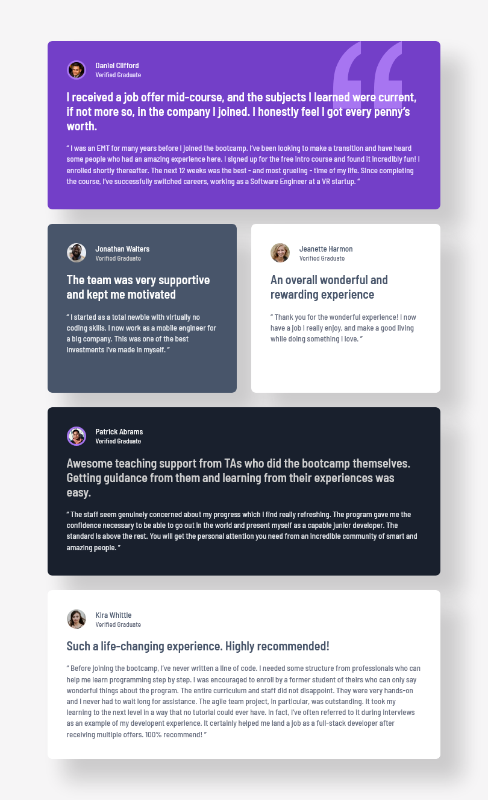

# Frontend Mentor - Testimonials grid section solution

This is a solution to the [Testimonials grid section challenge on Frontend Mentor](https://www.frontendmentor.io/challenges/testimonials-grid-section-Nnw6J7Un7). Frontend Mentor challenges help you improve your coding skills by building realistic projects. 

## Table of contents

- [Overview](#overview)
  - [The challenge](#the-challenge)
  - [Screenshot](#screenshot)
  - [Links](#links)
- [My process](#my-process)
  - [Built with](#built-with)
  - [What I learned](#what-i-learned)
  - [Continued development](#continued-development)
  - [Useful resources](#useful-resources)
- [Author](#author)
- [Acknowledgments](#acknowledgments)

## Overview

### The challenge

Users should be able to:

- View the optimal layout for the site depending on their device's screen size

### Screenshot

#### Mobile

#### Tablet

#### Desktop


### Links

- Solution URL: [Testimonial-Grid-Section on Github.com](https://github.com/ashkir004/Testimonials-Grid-Section)
- Live Site URL: [Testimonial-Grid-Section on Netlify.app](https://testimonials-grid-section-ashkir004-netlify.com)

## My process

### Built with

- Semantic HTML5 markup
- CSS custom properties
- CSS Grid
- Mobile-first workflow


### What I learned

- Usage of `.card` base class for flex layout, padding, border-radius, box-shadow, and relative positioning.
- Usage of Modifier classes (`.card--primary`, `.card--secondary`, `.card--accent`, `.card--light`) to set background and text colors using CSS variables.
- Usage of Classes like `.card__title`, `.card__status`, `.card__summary`, `.card__quote` use CSS variables for color, font size, weight, and line height.

```css
/* Base class */
.card {
    display: flex;
    flex-direction: column;
    gap: var(--space-200);
    padding: var(--space-400);
    border-radius: var(--space-100);
    box-shadow: 2rem 2rem 2rem .3rem hsl(0, 0%, 7%, 18%);
    position: relative;
    z-index: -1;
}

/* class modifier */
.card--primary {
    --card-bg: var(--primary-purple-500);
    --card-title:  var(--neutral-white);
    --card-status: var(--primary-purple-50);
    --card-summary: var(--neutral-white);
    --card-quote: var(--primary-purple-50);
    background-color: var(--card-bg);
}

.card--secondary {
    --card-bg: var(--neutral-grey-500);
    --card-title:  var(--neutral-white);
    --card-status: var(--neutral-grey-200);
    --card-summary: var(--neutral-white);
    --card-quote: var(--neutral-grey-100);
    background-color: var(--card-bg);
}

/* text-preset */
.card__title {
    color: var(--card-title);
    font-size: var(--font-md);
    font-weight: var(--font-weight-medium);
    line-height: var(--line-height-normal);
}

```


### Continued development

- Learn how to use theming structure for consistent and flexible visual appearance. 
- Learn how to create a multi-purpose, responsive grid


### Useful resources

- [Interactive guide to grid](https://www.joshwcomeau.com/css/interactive-guide-to-grid/)


## Author

- Frontend Mentor - [@ashkir004](https://www.frontendmentor.io/profile/ashkir004)
- Github - [@ashkir004](https://www.github.com/ashkir004)


## Acknowledgments
- Frontend Mentor - [Frontendmentor.io](https://www.frontendmentor.io/)


